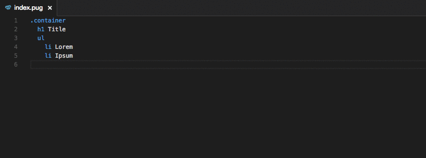

# pug2html

Pug to html runs the currently opened file through the `pug` Plugin and displays
the output html.  

## Extension Settings

* `pug2html.compileOptions`: the options that are passed to pug for compilation
* `pug2html.compileOptionsPath`: a path to a json or js file that exports the compile options

If the file at `compileOptionsPath` exports a function, than that function is called in order to get the compile options. 
In this case the file name is passed as an argument to the function.
